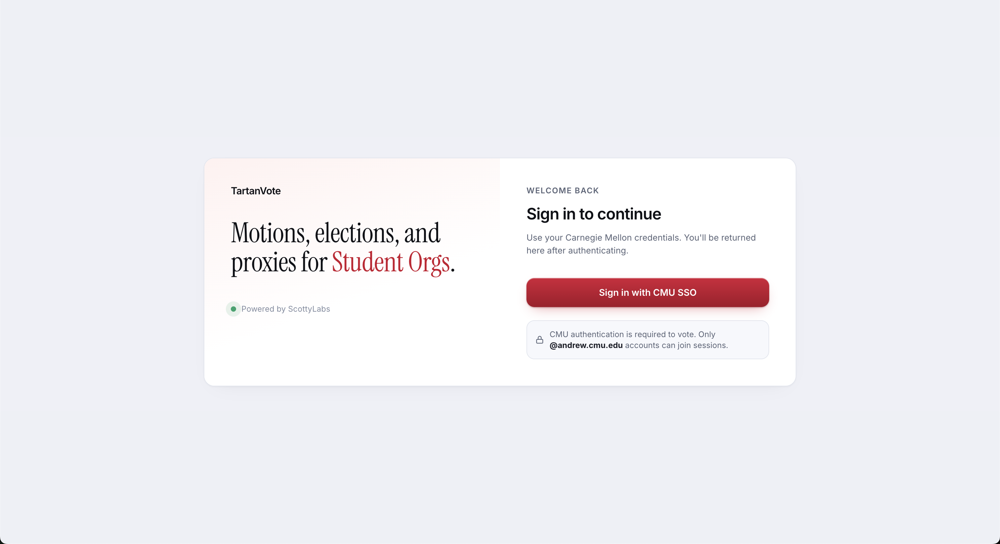
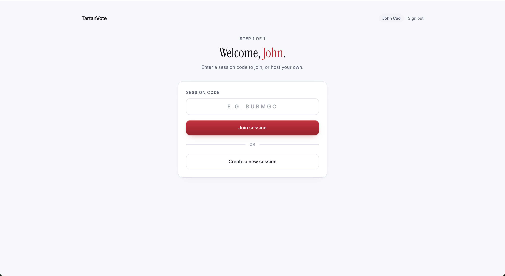
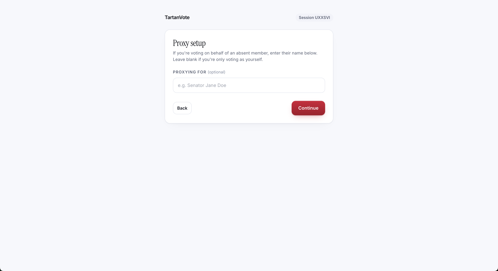
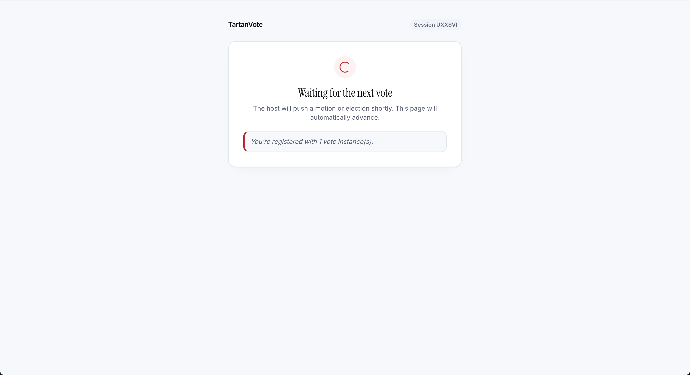
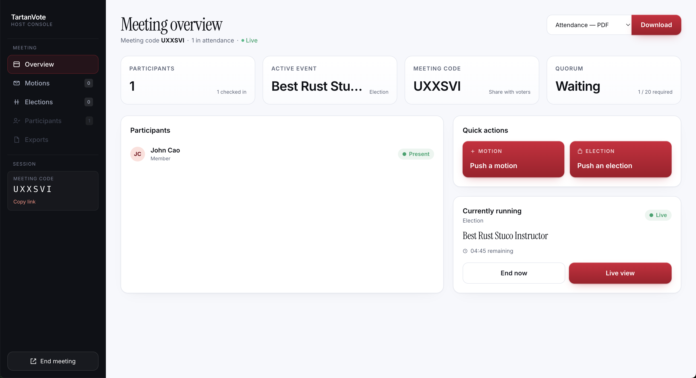
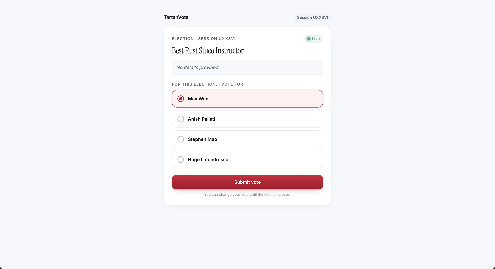
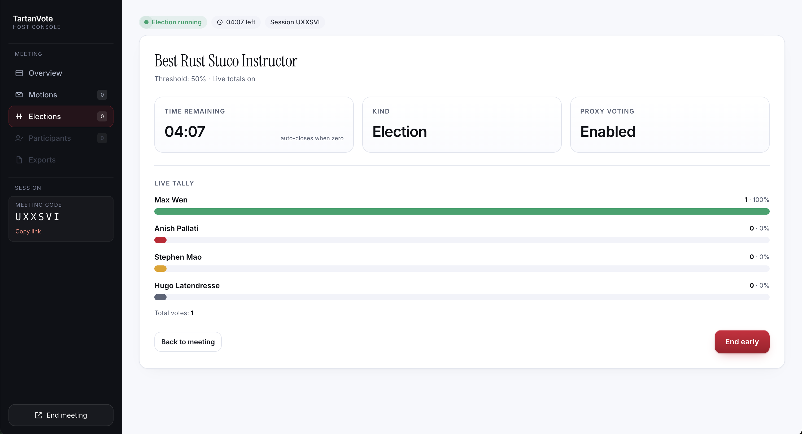

# Tartan Vote

Tartan Vote is a CMU Undergraduate Senate-commissioned, ScottyLabs-developed voting app, to help the Senate and other student organizations manage attendance and host elections and motions. Currently, the app is still under development, but we _strongly_ hope to get it completed very soon! <!-- Add information about where to access the website here, when the MVP is done! -->

### Built With

- Svelte
- Rust
- PostgreSQL

## Assumptions about the reader

Hello, reader! For the remainder of this README, and other documentation, we will assume that you are a developer or contributor, using WSL or a Unix development system, and have some familiarity with the command line. If you need any help, you are free to contact one of the codeowners found in CODEOWNERS, or join the [discord](https://go.scottylabs.org/discord).

## Photos















## Getting Started

### Prerequisites

- [devenv](https://devenv.sh/getting-started/) — provides Cargo, Deno, Node, PostgreSQL, and other tooling via Nix
- [direnv](https://direnv.net/) (recommended)

### Quick Setup

For detailed setup instructions, see [SETUP.md](docs/SETUP.md). Configuration and
secrets are documented in [secrets-and-config.md](docs/secrets-and-config.md).

Authenticate once per machine with OpenBao so secretspec can read dev secrets:

```bash
export BAO_ADDR=https://secrets2.scottylabs.org
bao login -method=oidc
```

Allow direnv (or enter the shell manually):

```bash
direnv allow
# or: devenv shell
```

Start all dev processes:

```bash
devenv up
# or: devenv processes up
```

This starts the API (`api`) and Svelte frontend (`frontend`). Inside the devenv shell, constants, host URLs, `DATABASE_URL`, and secrets are provided automatically.

### Deployment

Production runs on [Kennel](https://codeberg.org/ScottyLabs/kennel) via devenv and secretspec.

### Contributing

Please check [CONTRIBUTING.md](docs/CONTRIBUTING.md) before you contribute to this project!

### Licenses

Voting App is distributed under the Apache 2.0 and MIT Licenses, found in the files `LICENSE-APACHE-2.0` and `LICENSE-MIT` respectively.
